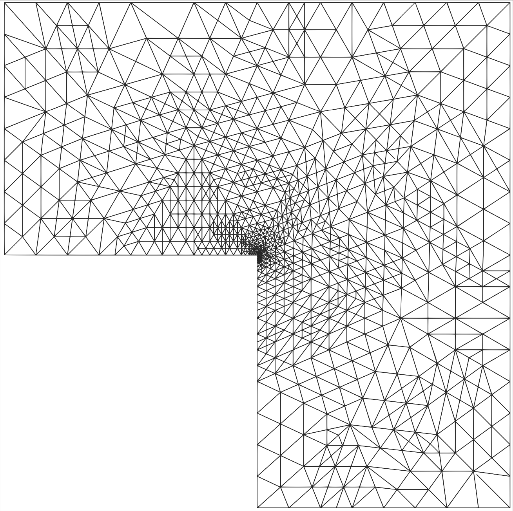

# Projects 

You can find here the summaries of some projects I have been or I am currently working on.

### ===============================================================

## Gradient reconstruction for multimaterial finite element simulations

### 🚧 This section is under construction. 🏗️👷

### ===============================================================

## Multi-mesh discretization of the spectral fractional Laplacian

On September 2023 I have been invited by <a href="https://web.mat.bham.ac.uk/A.Bespalov/" target=_blank>Dr. Alex Bespalov</a> at University of Birmingham to work on a multi-mesh algorithm to discretize and solve spectral fractional Laplacian equations numerically.

This work is motivated by the fact that, in the context of rational approximations of the fractional Laplacian (see the section below for more details), the resulting non-fractional parametric problems (equations $$(8)$$ in the section below) do not need to be solved on the same finite element mesh.
Thus, it is possible to drastically reduce the computational cost by using one mesh per parametric problem with different levels of refinements.

### ===============================================================

## A posteriori error estimation for the spectral fractional Laplacian

Fractional partial differential equations have gained a lot of interest in the last decades.
These equations are well suited to model phenomena that are <b>non-local in space</b> with a relatively small number of parameters.
To be able to solve such problems numerically is useful in a wide range of applications such as, for example, <b>anomalous diffusion</b> (see e.g. <a href="https://arxiv.org/abs/1707.01566" target=_blank>here</a>), <b>electro-magnetism</b> (see e.g. <a href="https://arxiv.org/abs/1902.05096" target=_blank>here</a>), <b>phase fluids</b> (see e.g. <a href="https://epubs.siam.org/doi/10.1137/16M1075302" target=_blank>here</a>), <b>porous media</b> (see e.g. <a href="https://arxiv.org/abs/1502.06383" target=_blank>here</a>), <b>quasi-geostrophic flows</b> (see e.g. <a href="https://arxiv.org/abs/2006.01180" target=_blank>here</a>) or <b>spatial statistics</b> (see e.g. <a href="https://arxiv.org/abs/1705.06565" target=_blank>here</a>).

Many <b>non equivalent</b> definitions of the fractional Laplacian are available on bounded domains (see e.g. <a href="https://arxiv.org/abs/1801.09767" target=_blank>here</a>).
Here we only consider a particular definition: the spectral fractional Laplacian.
The FEniCSx library FEniCSx-EE (see below) has been used to estimate the numerical error induced by the finite element discretization of spectral fractional Laplacian equations.

### Spectral fractional Laplacian

The spectral fractional Laplacian is a pseudo-differential operator used to model phenomena that are <b>non-local in space</b>.
An example of spectral fractional Laplacian problem is

$$\begin{equation}
  (-\Delta)^s u = f\quad \text{in } \Omega,\quad u = 0\quad \text{on } \partial \Omega.
\end{equation}$$

The solution to $$(1)$$ is defined by

$$\begin{equation}
  u := \sum_{i=0}^{+\infty} \lambda_i^{-s} (f,\psi_i)_{L^2(\Omega)} \psi_i,
\end{equation}$$

where $$\{(\lambda_i, \psi_i) \in \mathbb R_{>0} \times L^2(\Omega)\quad \forall i=0,\cdots,+\infty\}$$ is the spectrum of the standard Laplacian over $$\Omega$$.

### Rational approximation

Using a rational function $$\lambda \mapsto \mathcal Q_s^N(\lambda)$$ approaching the function $$\lambda \mapsto \lambda^{-s}$$ we can rewrite $$(1)$$ as a set of non-fractional reaction-diffusion equations.
Let

$$\begin{equation}
  \mathcal Q_s^N(\lambda) := C_N \sum_{l=1}^N a_l (c_l + b_l \lambda)^{-1} \simeq \lambda^{-s}\quad \forall \lambda \in [\lambda_0,+\infty),
\end{equation}$$

where $$C_N \in \mathbb R_{>0}$$ and $$\{(a_l, b_l, c_l) \in \mathbb R^3_{>0}\quad \forall l=1,\cdots,N\}$$ are well-chosen coefficients (see e.g. <a href="https://arxiv.org/abs/1612.04846" target=_blank>here</a> or <a href="https://arxiv.org/abs/1307.0888" target=_blank>here</a>).
For a extensive discussion on rational approximations applied to the discretization of fractional PDEs see <a href="https://www.sciencedirect.com/science/article/abs/pii/S0898122119303773?via%3Dihub" target=_blank>here</a>.

We can replace $$\lambda^{-s}$$ in $$(2)$$ and derive

$$\begin{equation}
  u_N := \sum_{i=0}^{+\infty} \mathcal Q_s^N(\lambda) (f,\psi_i)_{L^2(\Omega)} \psi_i,
\end{equation}$$

which, from $$(3)$$, can be reformulated into

$$\begin{equation}
  u_N := C_N \sum_{l=1}^N a_l u_l,
\end{equation}$$

with $$\{u_l \in H^1_0(\Omega),\quad \forall l=1,\cdots,N\}$$ solutions to the following non-fractional reaction-diffusion equations

$$\begin{equation}
  c_l (u_l,v)_{L^2(\Omega)} + b_l (\nabla u_l, \nabla v)_{L^2(\Omega)} = (f,v)_{L^2(\Omega)}\quad \forall v \in H^1_0(\Omega)\quad \forall l=1,\cdots, N.
\end{equation}$$

These problems can be discretized using a finite element method in order to get a fully discrete approximation to $$u$$. Given a finite element space $$V \subset H^1_0(\Omega)$$ associated to a mesh $$\mathcal T$$ of $$\Omega$$, we define

$$\begin{equation}
  u_{N,V} := C_N \sum_{l=1}^N a_l u_{l,V},
\end{equation}$$

where $$\{u_{l,V} \in V,\quad \forall l=1,\cdots,N\}$$ are solutions to the following finite element problems

$$\begin{equation}
  c_l (u_{l,V},v)_{L^2(\Omega)} + b_l (\nabla u_{l,V}, \nabla v)_{L^2(\Omega)} = (f,v)_{L^2(\Omega)}\quad \forall v \in V\quad \forall l=1,\cdots, N.
\end{equation}$$

Thus,

$$\begin{equation}
  u \simeq u_{N,V}.
\end{equation}$$

The convergence of $$u_{N,V}$$ to $$u$$ is discussed e.g. <a href="https://arxiv.org/abs/1307.0888" target=_blank>here</a>.

### Error estimation

We take advantage of the method described in the section below to derive an a posteriori error estimator in the context of a spectral fractional Laplacian equation.

For a cell $$T$$ of the mesh $$\mathcal T$$, we are interested in a computable quantity $$\eta_{\mathcal Q_s^N,T}^{\mathrm{bw}}$$ such that

$$\begin{equation}
  \eta_{\mathcal Q_s^N,T}^{\mathrm{bw}} \simeq ||u_{|T} - u_{N,V|T}||_{L^2(T)}.
\end{equation}$$

We define $$\eta_{\mathcal Q_s^N,T}^{\mathrm{bw}} := \| e_{N,V,T}\|_{L^2(T)}$$ where

$$\begin{equation}
  e_{N,V,T} := C_N \sum_{l=1}^N a_l e_{l,V,T},
\end{equation}$$

where $$\{e_{l,V,T}\quad \forall l=1,\cdots,N\quad \forall T \text{ cell of the mesh}\}$$ are solutions to local Neumann problems on each cell, derived from the parametric problems $$(8)$$.
These solutions can be computed using FEniCSx-EE.

The global estimator $$\eta_{\mathcal Q_s^N}^{\mathrm{bw}}$$ is then computed from the local contributions

$$\begin{equation}
  {\eta_{\mathcal Q_s^N}^{\mathrm{bw}}}^2 := \sum_{T \in \mathcal T} {\eta_{\mathcal Q_s^N,T}^{\mathrm{bw}}}^2,
\end{equation}$$

such that

$$\begin{equation}
  \eta_{\mathcal Q_s^N}^{\mathrm{bw}} \simeq ||u - u_{N,V}||_{L^2(\Omega)}.
\end{equation}$$

In <a href="https://doi.org/10.1016/j.cma.2023.115943" target=_blank>here</a> we give the details of the implementation of this method using FEniCSx-EE and we apply it to adaptive mesh refinement in the context of spectral fractional Laplacian equations.

### Example

If we solve $$(1)$$ on the unit square $$\Omega = [0,1]^2$$ with a piecewise constant data $$f$$, adaptive refinement is required to improve the convergence rate for small values of $$s$$ <b>only</b> due to boundary layers behavior of the problem.
For $$s$$ close to $$1$$ the corresponding problem becomes very similar to a standard (non-fractional) Laplacian equation where the convergence rate can not be improved by adaptive refinement.

Above is a plot showing the convergence rates of the Bank-Weiser estimator for different values of $$s$$.
The light dashed lines correspond to uniform refinement while the solid lines correspond to adaptive refinement.
As expected for this kind of problem, adaptive refinement improves the convergence rate for small values of $$s$$ but is not necessary when $$s$$ is close to $$1$$.

### ===============================================================

## FEniCSx-Error-Estimation

### What is FEniCSx-EE ?

FEniCSx-EE is an open source library for the finite element software <a href="https://fenicsproject.org/" target=_blank>FEniCSx</a>. The goal of this library is to provide an <b>implicit hierarchical a posteriori error estimation method</b>. The method used in FEniCSx-EE has been introduced by R. E. Bank and A. Weiser in this <a href="https://www.ams.org/journals/mcom/1985-44-170/S0025-5718-1985-0777265-X/" target=_blank>research paper</a>.

### The Bank-Weiser estimator

The Bank-Weiser estimator is computed from local solves of Neumann boundary value problems at the level of the mesh cells.

This estimator has several advantages:
- **It is fully local**: its local contributions are based on solutions to Neumann boundary value problems restricted to each cells of the mesh.
- **It can be adapted to many contexts** such as diffusion, reaction-diffusion, convection-diffusion, linear elasticity, Stokes, fractional Laplacian equations.
- **It is robust**: with respect to the coefficient in singularly perturbed reaction-diffusion equations, to the coefficient in convection-dominated convection-diffusion equations and also to linear elasticity in the incompressible limit.
- **It is flexible**: it is possible to vary parameters in the definition of the estimator in order to find the most accurate one.

Details on our algorithm implemented in FEniCSx-EE and examples of applications can be found in the <a href="https://doi.org/10.1016/j.camwa.2022.11.009" target=_blank>dedicated publication</a>.

### The derivation of the Bank-Weiser estimator

We consider the following standard Laplacian equation on a bounded domain with homogeneous Dirichlet boundary condition in weak formulation: we seek $$u \in H^1_0(\Omega)$$ such that

$$\begin{equation}
  (\nabla u, \nabla v)_{L^2(\Omega)} = (f,v)_{L^2(\Omega)}\quad \forall v \in H^1_0(\Omega).
\end{equation}$$

Given a mesh $$\mathcal T$$ on $$\Omega$$ and an associated finite element space $$V \subset H^1_0(\Omega)$$ the finite element discretization of $$(14)$$ reads: seek $$u_V \in V$$ such that

$$\begin{equation}
  (\nabla u_V, \nabla v)_{L^2(\Omega)} = (f,v)_{L^2(\Omega)}\quad \forall v \in V.
\end{equation}$$

From $$(14)$$ and $$(15)$$ we can derive a <b>local</b> equation for the approximation discrepancy given by the function $$e := u - u_V$$.
If we denote $$T$$ a cell of $$\mathcal T$$, $$\partial T$$ the set of edges of $$T$$ and $$E$$ the edges, the restriction $$e_T := e_{|T}$$ is solution to the following <b>local Neumann problem</b> in weak formulation

$$\begin{equation}
  (\nabla e_T, \nabla v)_{L^2(T)} = (r_T,v)_{L^2(T)} + \frac{1}{2}\sum_{E \in \partial T} (J_E,v)_{L^2(E)}\quad \forall v \in H^1_0(\Omega),
\end{equation}$$

where $$r_T$$ and $$J_E$$ are <b>computable functions</b> depending on $$f_V$$ (the $$L^2$$ projection of $$f$$ onto $$V$$) and $$u_V$$ only.

The core idea of the Bank-Weiser error estimation is to pick a proper space $$V^{\mathrm{bw}}(T)$$ to discretize $$(16)$$ and obtain a computable function $$e_T^{\mathrm{bw}}$$, solution to

$$\begin{equation}
  (\nabla e_T^{\mathrm{bw}}, \nabla v)_{L^2(T)} = (r_T,v)_{L^2(T)} + \frac{1}{2}\sum_{E \in \partial T} (J_E,v)_{L^2(E)}\quad \forall v \in V^{\mathrm{bw}}(T).
\end{equation}$$

Note that, since these problems are fully independent from a cell $$T$$ to another, they can be solved in parallel.
Thus, for a given norm, the local finite element error is approached by the Bank-Weiser estimator defined as follow

$$\begin{equation}
  \|e_T\| \simeq \|e_T^{\mathrm{bw}}\| =: \eta_T^{\mathrm{bw}}.
\end{equation}$$

The quantity $$\eta_T^{\mathrm{bw}}$$ can be used to perform adaptive refinement and to approach the global finite element error as follow

$$\begin{equation}
  \| e\|^2 \simeq \sum_{T \in \mathcal T} {\eta_T^{\mathrm{bw}}}^2.
\end{equation}$$

In <a href="https://doi.org/10.1016/j.camwa.2022.11.009" target=_blank>here</a> we develop a new parallel implementation of the Bank-Weiser a posteriori error estimator and we apply it to various problems such as adaptive refinement for standard Laplacian equations with different kinds of boundary conditions, for nearly-incompressible linear elasticity equations and for goal-oriented error estimation.

Above are two meshes adapted using the Bank-Weiser estimator.
On the left is a standard Laplacian equation on a 2D L-shaped domain.
On the right is the mesh of a femur bone on which nearly-incompressible linear elasticity equations are applied.
The mesh on the right is adapted with respect to a quantity of interest centered in the middle part of the bone.

Above is the plot showing the <b>strong scaling</b> of our parallel implementation of the Bank-Weiser estimator. 

### Getting started with FEniCSx-EE

To download and get started with FEniCSx-EE, please follow the instructions from the README file on the <a href="https://github.com/jhale/fenicsx-error-estimation" target=_blank>github repository</a>.
Once this is done, you are good to go and can write your FEniCSx script e.g. in the `demo/` directory.

<i class="fa fa-exclamation-triangle" aria-hidden="true"></i> FEniCSx-EE is not currently compatible with the last stable version of FEniCSx. Maintaining FEniCSx-EE is not part of my current position but I try to update it when I find some time. 👷

### ===============================================================