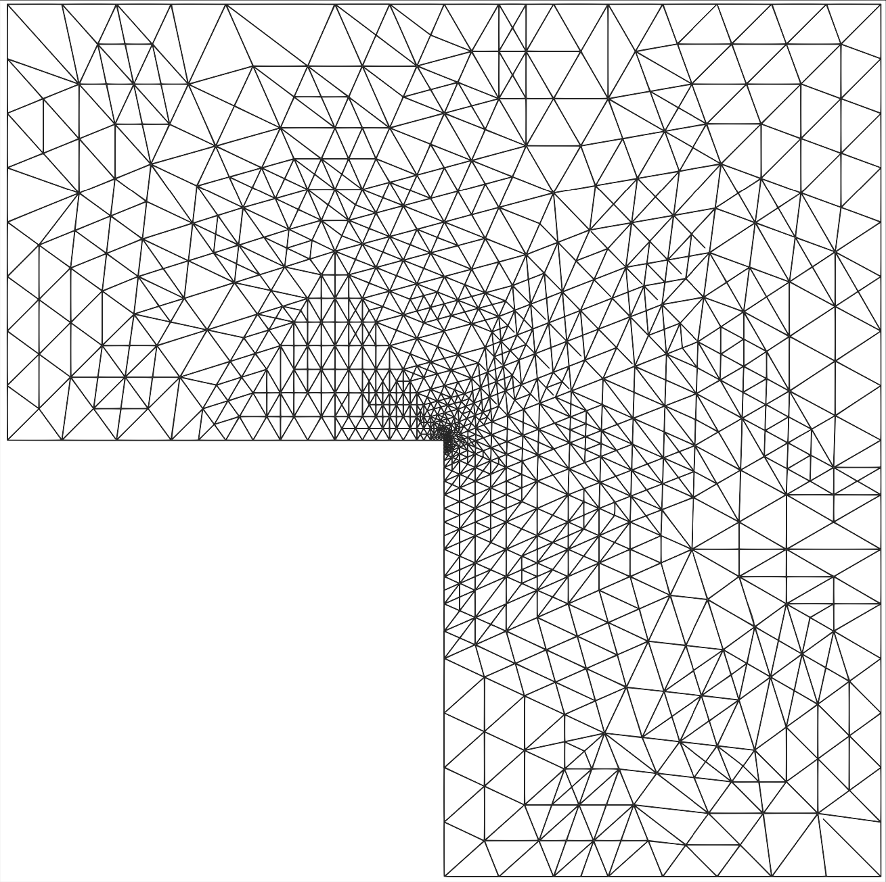
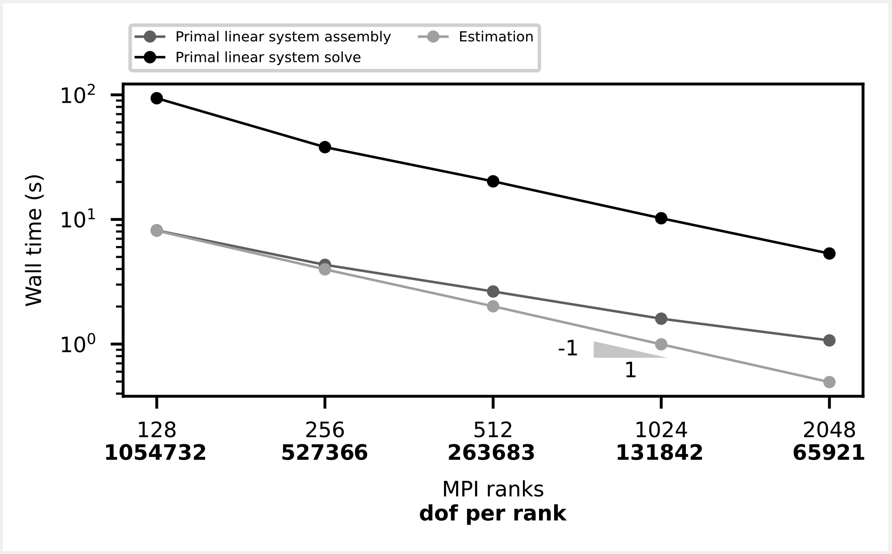

## FEniCSx-Error-Estimation

{:refdef: style="text-align: center;"}
{:height="150em"}
{: refdef}

See all the details in the <a href="https://doi.org/10.1016/j.camwa.2022.11.009" target=_blank>dedicated publication</a> and the <a href="https://github.com/jhale/fenicsx-error-estimation" target=_blank>code repository</a>.

### What is FEniCSx-EE ?

FEniCSx-EE is an open source library for the finite element software <a href="https://fenicsproject.org/" target=_blank>FEniCSx</a>. The goal of this library is to provide an <b>implicit hierarchical a posteriori error estimation method</b>. The method used in FEniCSx-EE has been introduced by R. E. Bank and A. Weiser in this <a href="https://www.ams.org/journals/mcom/1985-44-170/S0025-5718-1985-0777265-X/" target=_blank>research paper</a>.

### The Bank-Weiser estimator

The Bank-Weiser estimator is computed from local solves of Neumann boundary value problems at the level of the mesh cells.

This estimator has several advantages:
- **It is fully local**: its local contributions are based on solutions to Neumann boundary value problems restricted to each cells of the mesh.
- **It can be adapted to many contexts** such as diffusion, reaction-diffusion, convection-diffusion, linear elasticity, Stokes, fractional Laplacian equations.
- **It is robust**: with respect to the coefficient in singularly perturbed reaction-diffusion equations, to the coefficient in convection-dominated convection-diffusion equations and also to linear elasticity in the incompressible limit.
- **It is flexible**: it is possible to vary parameters in the definition of the estimator in order to find the most accurate one.

Details on our algorithm implemented in FEniCSx-EE and examples of applications can be found in the <a href="https://doi.org/10.1016/j.camwa.2022.11.009" target=_blank>dedicated publication</a>.

### The derivation of the Bank-Weiser estimator

We consider the following standard Laplacian equation on a bounded domain with homogeneous Dirichlet boundary condition in weak formulation: we seek $$u \in H^1_0(\Omega)$$ such that

$$\begin{equation}
  (\nabla u, \nabla v)_{L^2(\Omega)} = (f,v)_{L^2(\Omega)}\quad \forall v \in H^1_0(\Omega).
\end{equation}$$

Given a mesh $$\mathcal T$$ on $$\Omega$$ and an associated finite element space $$V \subset H^1_0(\Omega)$$ the finite element discretization of $$(14)$$ reads: seek $$u_V \in V$$ such that

$$\begin{equation}
  (\nabla u_V, \nabla v)_{L^2(\Omega)} = (f,v)_{L^2(\Omega)}\quad \forall v \in V.
\end{equation}$$

From $$(14)$$ and $$(15)$$ we can derive a <b>local</b> equation for the approximation discrepancy given by the function $$e := u - u_V$$.
If we denote $$T$$ a cell of $$\mathcal T$$, $$\partial T$$ the set of edges of $$T$$ and $$E$$ the edges, the restriction $$e_T := e_{|T}$$ is solution to the following <b>local Neumann problem</b> in weak formulation

$$\begin{equation}
  (\nabla e_T, \nabla v)_{L^2(T)} = (r_T,v)_{L^2(T)} + \frac{1}{2}\sum_{E \in \partial T} (J_E,v)_{L^2(E)}\quad \forall v \in H^1_0(\Omega),
\end{equation}$$

where $$r_T$$ and $$J_E$$ are <b>computable functions</b> depending on $$f_V$$ (the $$L^2$$ projection of $$f$$ onto $$V$$) and $$u_V$$ only.

The core idea of the Bank-Weiser error estimation is to pick a proper space $$V^{\mathrm{bw}}(T)$$ to discretize $$(16)$$ and obtain a computable function $$e_T^{\mathrm{bw}}$$, solution to

$$\begin{equation}
  (\nabla e_T^{\mathrm{bw}}, \nabla v)_{L^2(T)} = (r_T,v)_{L^2(T)} + \frac{1}{2}\sum_{E \in \partial T} (J_E,v)_{L^2(E)}\quad \forall v \in V^{\mathrm{bw}}(T).
\end{equation}$$

Note that, since these problems are fully independent from a cell $$T$$ to another, they can be solved in parallel.
Thus, for a given norm, the local finite element error is approached by the Bank-Weiser estimator defined as follow

$$\begin{equation}
  \|e_T\| \simeq \|e_T^{\mathrm{bw}}\| =: \eta_T^{\mathrm{bw}}.
\end{equation}$$

The quantity $$\eta_T^{\mathrm{bw}}$$ can be used to perform adaptive refinement and to approach the global finite element error as follow

$$\begin{equation}
  \| e\|^2 \simeq \sum_{T \in \mathcal T} {\eta_T^{\mathrm{bw}}}^2.
\end{equation}$$

In <a href="https://doi.org/10.1016/j.camwa.2022.11.009" target=_blank>here</a> we develop a new parallel implementation of the Bank-Weiser a posteriori error estimator and we apply it to various problems such as adaptive refinement for standard Laplacian equations with different kinds of boundary conditions, for nearly-incompressible linear elasticity equations and for goal-oriented error estimation.

{:refdef: style="text-align: center;"}
{:width="300vw"}
{:width="400vw"}
{: refdef}

Above are two meshes adapted using the Bank-Weiser estimator.
On the left is a standard Laplacian equation on a 2D L-shaped domain.
On the right is the mesh of a femur bone on which nearly-incompressible linear elasticity equations are applied.
The mesh on the right is adapted with respect to a quantity of interest centered in the middle part of the bone.

{:refdef: style="text-align: center;"}
{:width="500vw"}
{: refdef}

Above is the plot showing the <b>strong scaling</b> of our parallel implementation of the Bank-Weiser estimator. 

### Getting started

To download and get started with FEniCSx-EE, please follow the instructions from the README file on the <a href="https://github.com/jhale/fenicsx-error-estimation" target=_blank>github repository</a>.

<i class="fa fa-exclamation-triangle" aria-hidden="true"></i> FEniCSx-EE is not currently compatible with the last stable version of FEniCSx. Maintaining FEniCSx-EE is not part of my current position but I try to update it when I find some time. 👷