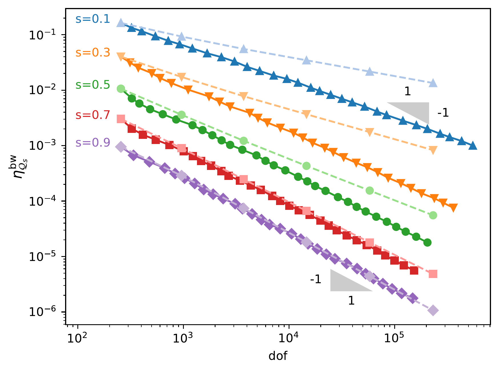

## A posteriori error estimation for the spectral fractional Laplacian

Fractional partial differential equations have gained a lot of interest in the last decades.
These equations are well suited to model phenomena that are <b>non-local in space</b> with a relatively small number of parameters.
To be able to solve such problems numerically is useful in a wide range of applications such as, for example, <b>anomalous diffusion</b> (see e.g. <a href="https://arxiv.org/abs/1707.01566" target=_blank>here</a>), <b>electro-magnetism</b> (see e.g. <a href="https://arxiv.org/abs/1902.05096" target=_blank>here</a>), <b>phase fluids</b> (see e.g. <a href="https://epubs.siam.org/doi/10.1137/16M1075302" target=_blank>here</a>), <b>porous media</b> (see e.g. <a href="https://arxiv.org/abs/1502.06383" target=_blank>here</a>), <b>quasi-geostrophic flows</b> (see e.g. <a href="https://arxiv.org/abs/2006.01180" target=_blank>here</a>) or <b>spatial statistics</b> (see e.g. <a href="https://arxiv.org/abs/1705.06565" target=_blank>here</a>).

Many <b>non equivalent</b> definitions of the fractional Laplacian are available on bounded domains (see e.g. <a href="https://arxiv.org/abs/1801.09767" target=_blank>here</a>).
Here we only consider a particular definition: the spectral fractional Laplacian.
The FEniCSx library FEniCSx-EE (see below) has been used to estimate the numerical error induced by the finite element discretization of spectral fractional Laplacian equations.

### Spectral fractional Laplacian

The spectral fractional Laplacian is a pseudo-differential operator used to model phenomena that are <b>non-local in space</b>.
An example of spectral fractional Laplacian problem is

$$\begin{equation}
  (-\Delta)^s u = f\quad \text{in } \Omega,\quad u = 0\quad \text{on } \partial \Omega.
\end{equation}$$

The solution to $$(1)$$ is defined by

$$\begin{equation}
  u := \sum_{i=0}^{+\infty} \lambda_i^{-s} (f,\psi_i)_{L^2(\Omega)} \psi_i,
\end{equation}$$

where $$\{(\lambda_i, \psi_i) \in \mathbb R_{>0} \times L^2(\Omega)\quad \forall i=0,\cdots,+\infty\}$$ is the spectrum of the standard Laplacian over $$\Omega$$.

### Rational approximation

Using a rational function $$\lambda \mapsto \mathcal Q_s^N(\lambda)$$ approaching the function $$\lambda \mapsto \lambda^{-s}$$ we can rewrite $$(1)$$ as a set of non-fractional reaction-diffusion equations.
Let

$$\begin{equation}
  \mathcal Q_s^N(\lambda) := C_N \sum_{l=1}^N a_l (c_l + b_l \lambda)^{-1} \simeq \lambda^{-s}\quad \forall \lambda \in [\lambda_0,+\infty),
\end{equation}$$

where $$C_N \in \mathbb R_{>0}$$ and $$\{(a_l, b_l, c_l) \in \mathbb R^3_{>0}\quad \forall l=1,\cdots,N\}$$ are well-chosen coefficients (see e.g. <a href="https://arxiv.org/abs/1612.04846" target=_blank>here</a> or <a href="https://arxiv.org/abs/1307.0888" target=_blank>here</a>).
For a extensive discussion on rational approximations applied to the discretization of fractional PDEs see <a href="https://www.sciencedirect.com/science/article/abs/pii/S0898122119303773?via%3Dihub" target=_blank>here</a>.

We can replace $$\lambda^{-s}$$ in $$(2)$$ and derive

$$\begin{equation}
  u_N := \sum_{i=0}^{+\infty} \mathcal Q_s^N(\lambda) (f,\psi_i)_{L^2(\Omega)} \psi_i,
\end{equation}$$

which, from $$(3)$$, can be reformulated into

$$\begin{equation}
  u_N := C_N \sum_{l=1}^N a_l u_l,
\end{equation}$$

with $$\{u_l \in H^1_0(\Omega),\quad \forall l=1,\cdots,N\}$$ solutions to the following non-fractional reaction-diffusion equations

$$\begin{equation}
  c_l (u_l,v)_{L^2(\Omega)} + b_l (\nabla u_l, \nabla v)_{L^2(\Omega)} = (f,v)_{L^2(\Omega)}\quad \forall v \in H^1_0(\Omega)\quad \forall l=1,\cdots, N.
\end{equation}$$

These problems can be discretized using a finite element method in order to get a fully discrete approximation to $$u$$. Given a finite element space $$V \subset H^1_0(\Omega)$$ associated to a mesh $$\mathcal T$$ of $$\Omega$$, we define

$$\begin{equation}
  u_{N,V} := C_N \sum_{l=1}^N a_l u_{l,V},
\end{equation}$$

where $$\{u_{l,V} \in V,\quad \forall l=1,\cdots,N\}$$ are solutions to the following finite element problems

$$\begin{equation}
  c_l (u_{l,V},v)_{L^2(\Omega)} + b_l (\nabla u_{l,V}, \nabla v)_{L^2(\Omega)} = (f,v)_{L^2(\Omega)}\quad \forall v \in V\quad \forall l=1,\cdots, N.
\end{equation}$$

Thus,

$$\begin{equation}
  u \simeq u_{N,V}.
\end{equation}$$

The convergence of $$u_{N,V}$$ to $$u$$ is discussed e.g. <a href="https://arxiv.org/abs/1307.0888" target=_blank>here</a>.

### Error estimation

We take advantage of the method described in the section below to derive an a posteriori error estimator in the context of a spectral fractional Laplacian equation.

For a cell $$T$$ of the mesh $$\mathcal T$$, we are interested in a computable quantity $$\eta_{\mathcal Q_s^N,T}^{\mathrm{bw}}$$ such that

$$\begin{equation}
  \eta_{\mathcal Q_s^N,T}^{\mathrm{bw}} \simeq ||u_{|T} - u_{N,V|T}||_{L^2(T)}.
\end{equation}$$

We define $$\eta_{\mathcal Q_s^N,T}^{\mathrm{bw}} := \| e_{N,V,T}\|_{L^2(T)}$$ where

$$\begin{equation}
  e_{N,V,T} := C_N \sum_{l=1}^N a_l e_{l,V,T},
\end{equation}$$

where $$\{e_{l,V,T}\quad \forall l=1,\cdots,N\quad \forall T \text{ cell of the mesh}\}$$ are solutions to local Neumann problems on each cell, derived from the parametric problems $$(8)$$.
These solutions can be computed using FEniCSx-EE.

The global estimator $$\eta_{\mathcal Q_s^N}^{\mathrm{bw}}$$ is then computed from the local contributions

$$\begin{equation}
  {\eta_{\mathcal Q_s^N}^{\mathrm{bw}}}^2 := \sum_{T \in \mathcal T} {\eta_{\mathcal Q_s^N,T}^{\mathrm{bw}}}^2,
\end{equation}$$

such that

$$\begin{equation}
  \eta_{\mathcal Q_s^N}^{\mathrm{bw}} \simeq ||u - u_{N,V}||_{L^2(\Omega)}.
\end{equation}$$

In <a href="https://doi.org/10.1016/j.cma.2023.115943" target=_blank>here</a> we give the details of the implementation of this method using FEniCSx-EE and we apply it to adaptive mesh refinement in the context of spectral fractional Laplacian equations.

### Example

If we solve $$(1)$$ on the unit square $$\Omega = [0,1]^2$$ with a piecewise constant data $$f$$, adaptive refinement is required to improve the convergence rate for small values of $$s$$ <b>only</b> due to boundary layers behavior of the problem.
For $$s$$ close to $$1$$ the corresponding problem becomes very similar to a standard (non-fractional) Laplacian equation where the convergence rate can not be improved by adaptive refinement.

{:refdef: style="text-align: center;"}
{:width="500vw"}
{: refdef}

Above is a plot showing the convergence rates of the Bank-Weiser estimator for different values of $$s$$.
The light dashed lines correspond to uniform refinement while the solid lines correspond to adaptive refinement.
As expected for this kind of problem, adaptive refinement improves the convergence rate for small values of $$s$$ but is not necessary when $$s$$ is close to $$1$$.