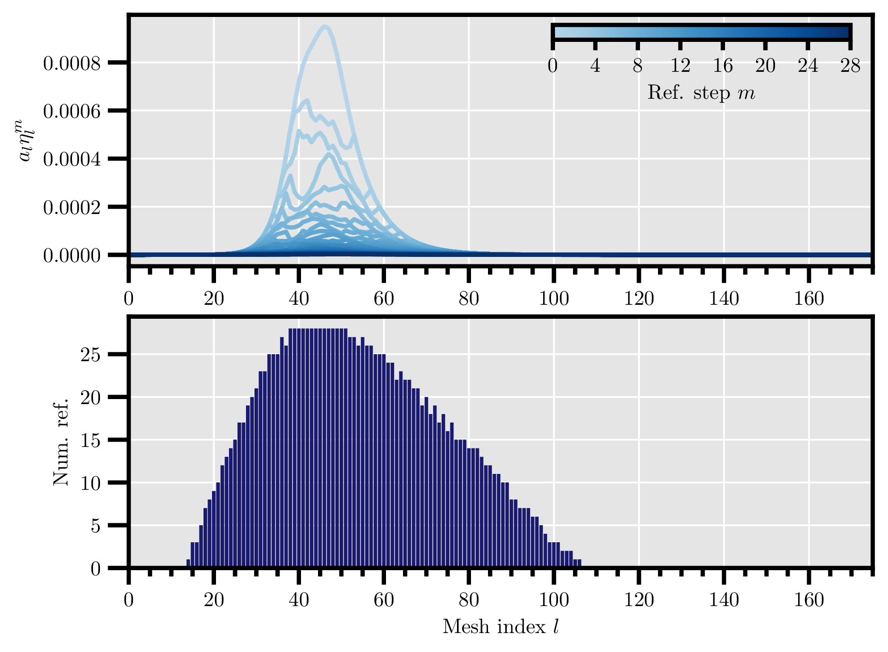

## Multi-mesh discretization of the spectral fractional Laplacian

On September 2023 I have been invited by <a href="https://web.mat.bham.ac.uk/A.Bespalov/" target=_blank>Dr. Alex Bespalov</a> at University of Birmingham to work on a multi-mesh algorithm to discretize and solve spectral fractional Laplacian equations numerically.

This work is motivated by the fact that, in the context of rational approximations of the fractional Laplacian (see [here]() for more details), the resulting non-fractional parametric problems (see equations $$(8)$$ [here]()) do not need to be solved on the same finite element mesh.
Thus, it is possible to drastically reduce the computational cost by using one mesh per parametric problem with different levels of refinements.

{:refdef: style="text-align: center;"}
{:width="500vw"}
{: refdef}