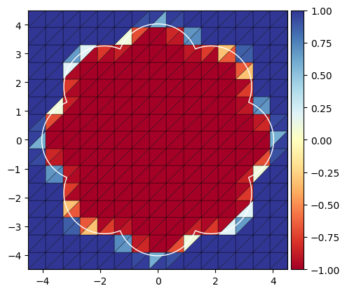
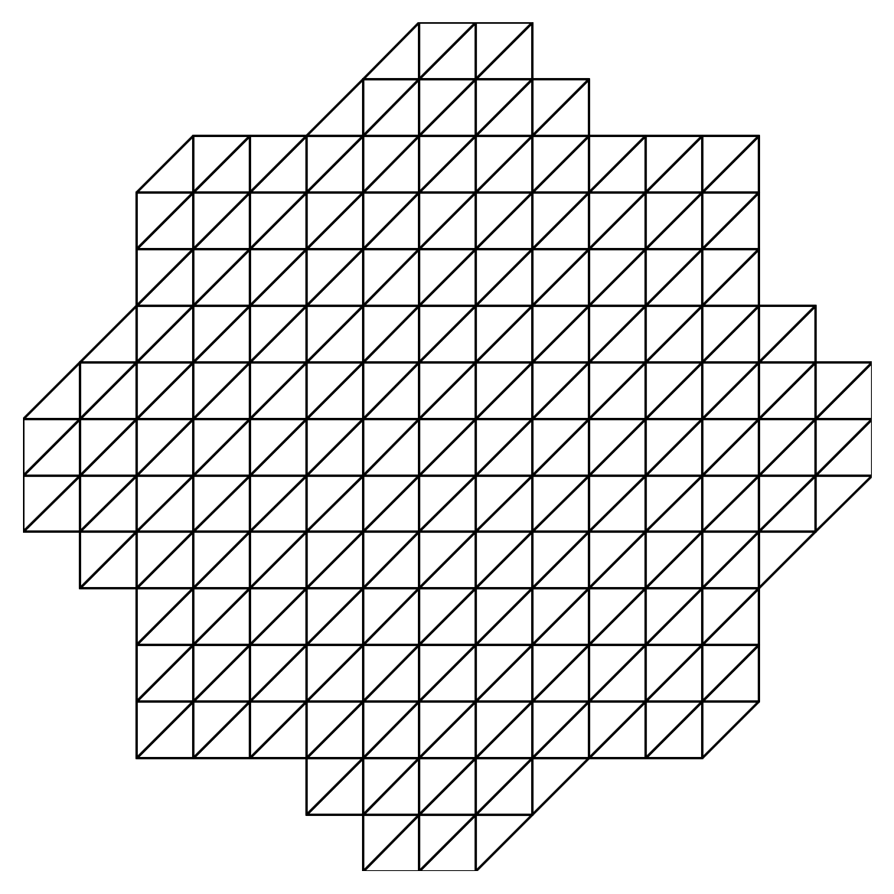

## Residual-based a posteriori error estimates with boundary correction for &phi;-FEM

### The &phi;-Finite Element Method

The &phi;-FEM belongs to the family of Immersed Boundary Methods.
It is designed to solve partial differential equations (PDEs) on complicated domains with *unfitted meshes*.

{:refdef: style="text-align: center;"}
{:width="400vw"}
{: refdef}

On the above figure, the exact domain is delimited by the "flower-shaped" white curve.
In &phi;-FEM, a PDE can be solved on this domain using the unfitted mesh (called *background mesh*) shown on the figure.

What sets &phi;-FEM apart from other Immersed Boundary Methods is that there is no integral to compute on cut elements, so no unconventional quadrature rule is needed.

Let $$\varphi$$ be a sufficiently regular levelset function.
The physical domain $$\Omega$$ and its boundary $$\Gamma$$ are defined via $$\varphi$$ as follow

$$\begin{equation}
  \Omega := \{\varphi < 0\},\quad \Gamma := \{\varphi = 0\}.
\end{equation}$$

Thus, given $$f \in L^2(\Omega)$$, we are interested by the following Poisson--Dirichlet problem: seek $$u$$ such that

$$\begin{equation}
  -\Delta u = f\quad \text{in } \Omega,\qquad u = 0\quad \text{on } \Gamma.
\end{equation}$$

The key idea of &phi;-FEM is to reformulate the function $$u$$ as: $$\varphi w$$ and to approximate this product by $$\varphi_h w_h$$, where $$\varphi_h$$ is an interpolation of $$\varphi$$ on the background mesh and $$w_h$$ is a finite element function also defined on the background mesh.

Let us denote $$\mathcal T_h^{\mathcal O}$$ the background mesh, $$\mathcal T_h := \{T \in \mathcal T_h^{\mathcal O};\ T \cap \{\varphi_h < 0\} \neq \varnothing\}$$ and $$\Omega_h := \cup_{T \in \mathcal T_h} T$$.
We introduce the linear Lagrange finite element space

$$\begin{equation}
  V_h := \left\{v_h \in H^1(\Omega);\ {v_h}_{|T} \in \mathbb P_1(T)\ \forall T \in \mathcal T_h \right\}.
\end{equation}$$

> **Remark:** For the sake of simplicity we consider a linear Lagrange space only but stress out that &phi;-FEM can be straightforwardly extended to higher order spaces.

The function $$w_h$$ is taken as the solution to the following &phi;-FEM discrete formulation: for all $$v_h \in V_h$$,

$$\begin{equation}
  \int_{\Omega_h} \nabla \varphi_h w_h \cdot \nabla \varphi_h v_h + \int_{\partial \Omega_h} \frac{\partial}{\partial } (\varphi_h w_h) \varphi_h v_h + G_h(w_h, v_h) = \int_{\Omega_h} f \varphi_h v_h + G_h^{\mathrm{rhs}}(v_h),
\end{equation}$$

where $$G_h$$ and $$G_h^{\mathrm{rhs}}$$ are stabilization terms (see [the original publication](https://arxiv.org/abs/1903.03703) for the definitions).

## A residual-based error estimator

Given the &phi;-FEM solution $$u_h = \varphi_h w_h$$, we can derive the following a posteriori error estimator:

$$\begin{equation}
  \eta^2 := \sum_{T \in \mathcal T_h} \eta_T^2,\quad \text{where}\quad \eta_T^2 := \eta_{r, T}^2 + \eta_{J, T}^2 + \eta_{\varepsilon, T}^2,
\end{equation}$$

and

$$\begin{align}
  \eta_{r,T} &:= h_T \| f_h + \Delta u_h\|_{L^2(T)},\\
  \eta_{J,T} &:= \frac{1}{2} \left[ \sum_{E \in \partial T} h_E \left\|\left[\frac{\partial}{\partial n} u_h \right]_E \right\|_{L^2(E)}^2\right]^{1/2},\\
  \eta_{\varepsilon,T} &:= |\varepsilon_h|_{H^1(T)}.
\end{align}$$

> **Remark:** For a cell $$T$$, the terms $$\eta_{r,T}$$ and $$\eta_{J,T}$$ are similar to the terms in the residual estimator for a standard FEM discretization of the Poisson-Dirichlet equation.

We show the reliability of $$\eta$$, in other words, there exists a constant $$C$$ depending on the regularity of the mesh only such that

$$\begin{equation}
  \lvert u - u_h \rvert_{H^1(\Omega)} \leqslant C \eta + \mathrm{h.o.t.},
  \label{eq:reliability}
\end{equation}$$

where $$\mathrm{h.o.t.}$$ are higher order terms, composed of oscillation terms from the discretization of $$f$$ and of $$\varphi$$.

## The boundary correction term

Let us detail why the boundary correction term, namely $$\eta_{\varepsilon, T}$$, is essential to the proof of eq. $$(\ref{eq:reliability})$$.
This correction term trick has been introduced for the first time in [here](https://doi.org/10.1093/imanum/draa085) in the context of a cutFEM.

To explain properly where does this term come from, let us first recall the proof of the reliability of the standard residual estimator.
Assume for a moment that the domain $$\mathcal T_h$$ fits the domain $$\Omega$$ and that $$u_h^*$$ is the solution of the finite element problem

$$\begin{equation}
  \int_{\Omega} \nabla u_h^* \cdot \nabla v_h = \int_{\Omega} f v_h\quad \forall v_h \in V_h^*,
\end{equation}$$

where $$V_h^*$$ is the subset of $$V_h$$ of functions vanishing on $$\Gamma$$.
Then $$u_h^* \in H^1_0(\Omega)$$ and so is $$u - u_h^*$$.
Moreover, we have **Galerkin orthogonality**: $$u - u_h^*$$ is orthogonal to $$V_h^*$$ in $$H^1_0(\Omega)$$.
Thus, for any $$v \in H^1_0(\Omega)$$, if we denote $$\mathcal I_h v$$ its Lagrange interpolant to $$V_h^*$$, we have

$$\begin{equation}
  \int_{\Omega} \nabla (u - u_h^*) \cdot \nabla v = \int_{\Omega} f (v - \mathcal I_h v) - \int_{\Omega} \nabla u_h^* \cdot \nabla (v - \mathcal I_h v),
  \label{eq:galerkin}
\end{equation}$$

the interpolant being introduced thanks to Galerkin orthogonality.

Now all the key pieces are in place and the remaining steps are:

1) Apply a cellwise integration by parts on the last integral of eq. $$(\ref{eq:galerkin})$$,  
2) Apply standard inequalities (Cauchy-Schwarz, trace and interpolation),  
3) Recall that
   
  $$\begin{equation}
    \lvert u - u_h^* \rvert_{H^1(\Omega)} = \underset{v \in H^1_0(\Omega), \lvert v \rvert \neq 0}{\min}  \frac{\displaystyle \int_{\Omega} \nabla (u - u_h^*) \cdot \nabla v}{\displaystyle \lvert v \rvert_{H^1(\Omega)}}
  \end{equation}$$,  

4) If everything went well, on the right hand side you would be able to get $$(\eta + \mathrm{h.o.t.}) \lvert v \rvert_{H^1(\Omega)}$$,  
  
In this proof, one of the key ingredients is that $$u - u_h^*$$ belongs to $$H^1_0(\Omega)$$,  

Now, let us come back to our &phi;-FEM case.
If we consider $$u - u_h$$, we remark that this function **does not belong to $$H^1_0(\Omega)$$**.
This is where $$\varepsilon$$ and its discretization $$\varepsilon_h$$ come into play: we decompose $$u - u_h$$ as a part in $$H^1_0(\Omega)$$ and a part orthogonal to $$H^1_0(\Omega)$$, denote $$\varepsilon$$.

The first step of the proof of eq. $$(\ref{eq:reliability})$$ consists in the introdution of a proper $$\varepsilon$$ function.
Let us consider $$\Pi u_h$$ the solution to

$$\begin{equation}
  \int_{\Omega} \nabla \Pi u_h \cdot \nabla v = \int_{\Omega} \nabla u_h \cdot \nabla v\quad \forall v \in H^1_0(\Omega).
\end{equation}$$

In other words, $$\Pi u_h$$ is the orthogonal projection of $$u_h$$ onto $$H^1_0(\Omega)$$ with respect to the $$H^1_0(\Omega)$$ inner product.

Now let us define $$\varepsilon := \Pi u_h - u_h$$. Thus, $$\varepsilon$$ is orthogonal to $$H^1_0(\Omega)$$, which yields

$$\begin{equation}
  \lvert u - u_h \vert_{H^1(\Omega)} = \lvert u - \Pi u_h \rvert_{H^1(\Omega)} + \lvert \Pi u_h - u_h \rvert_{H^1(\Omega)},
  \label{eq:orthogonality}
\end{equation}$$

since $$u - \Pi u_h \in H^1_0(\Omega)$$.

The second term of the right hand side of eq. $$(\ref{eq:orthogonality})$$ is $$\lvert \varepsilon \rvert_{H^1(\Omega)}$$ which is not computable as such, since $$\Pi u_h$$ is not a discrete function.
Therefore, we introduce 

$$\begin{align}
  \lvert \varepsilon \rvert_{H^1(\Omega)} &= \lvert \Pi u_h - u_h \rvert_{H^1(\Omega)}\notag\\
  &= \underset{v \in H^1_0(\Omega)}{\min} \lvert v - \varphi_h w_h \rvert_{H^1(\Omega)}\notag\\
  &\leqslant \lvert \varphi w_h - \varphi_h w_h \rvert_{H^1(\Omega)}\notag\\
  &\approx \lvert (\widetilde \varphi_h - \varphi_h) w_h \rvert_{H^1(\Omega)}
  =: \lvert \varepsilon_h \rvert_{H^1(\Omega)}
\end{align}$$

where $$\widetilde \varphi_h$$ is a finer approximation of $$\varphi$$ (e.g. its interpolation into a higher degree Lagrange finite element space).

> **Remark:** The function $$\varepsilon_h$$ can be see as a hierarchical approximation of the boundary discretization error induced by the interpolation $$\varphi_h$$.
> This term can be constructed such that it vanishes inside $$\Omega$$, far away from $$\Gamma$$.
> Then, only its values around $$\Gamma$$ influence the estimator $$\eta$$.

Using a triangular inequality in eq. $$(\ref{eq:orthogonality})$$ we obtain

$$\begin{equation}
  \lvert u - u_h \vert_{H^1(\Omega)} \leqslant \lvert u - \Pi u_h \rvert_{H^1(\Omega)} + \lvert \varepsilon_h \rvert_{H^1(\Omega)} + \lvert \varepsilon - \varepsilon_h \rvert_{H^1(\Omega)},
  \label{eq:epsilon_oscillations}
\end{equation}$$

where $$\lvert \varepsilon - \varepsilon_h \rvert_{H^1(\Omega)}$$ can be proven to be of higher order and where $$\lvert \varepsilon_h \rvert_{H^1(\Omega)}$$ can be decomposed as a sum of local contributions, leading to $$\eta_{\varepsilon, T}$$.

> **Remark:** The first term on the right hand side of eq. $$(\ref{eq:epsilon_oscillations})$$ can be controlled using the same tools as for the standard residual estimator, except two important points:
>
> - at some point a Hardy type inequality is necessary, see Lemma 6 [here](https://www.esaim-m2an.org/articles/m2an/abs/2023/03/m2an220037/m2an220037.html),
> - due to the discrepancy between $$\Gamma$$ and $$\{\varphi_h = 0\}$$ (the exact boundary and its approximation), we have to assume that $$f_h$$ is the $$L^2$$ projection of $$f$$ onto $$V_h$$, which is not what is usually required in the standard case.
>   In practice, for the sake of computational cost, $$f_h$$ is always taken as the interpolation of $$f$$ onto $$V_h$$ (or sometimes even onto a coarser space), therefore it might be possible to further improve the proof of eq. $$(\ref{eq:reliability})$$.

## An adaptive &phi;-FEM

This novel estimator allows to derive an adaptive mesh refinement loop:

$$\begin{equation*}
  \cdots \longrightarrow \mathrm{SOLVE} \longrightarrow \mathrm{ESTIMATE} \longrightarrow \mathrm{MARK} \longrightarrow \mathrm{REFINE} \longrightarrow \cdots
\end{equation*}$$

Here is an example on the "flower-shaped" domain with a piecewise constant source term equal to 10 in a circular region on the right of the domain and 0 elsewhere.

> **Remarks:**
> - Note the extra refinement at the several reentrant corners of the domain, this is expected due to singular gradients of the solution $$u$$ at these points.
> - On the last mesh, we can see a circle of refinement in the middle of the domain, this shouldn't be there. It appears because we are using a non-smooth levelset function $$\varphi$$ in this numerical example. With a smooth $$\varphi$$ only refinement on the right region and refinement near the reentrant corners should appear.

{:refdef: style="text-align: center;"}
{:width="500vw"}
{: refdef}