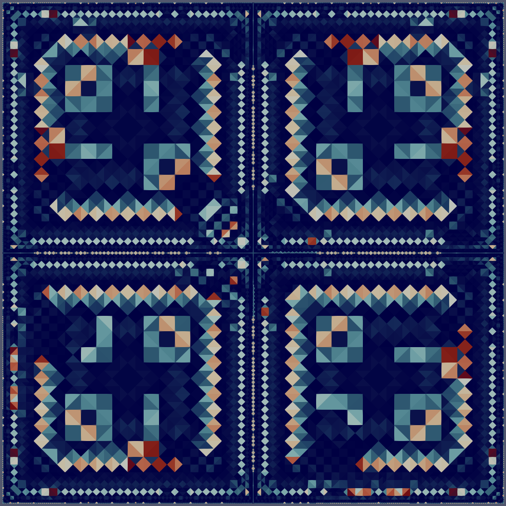
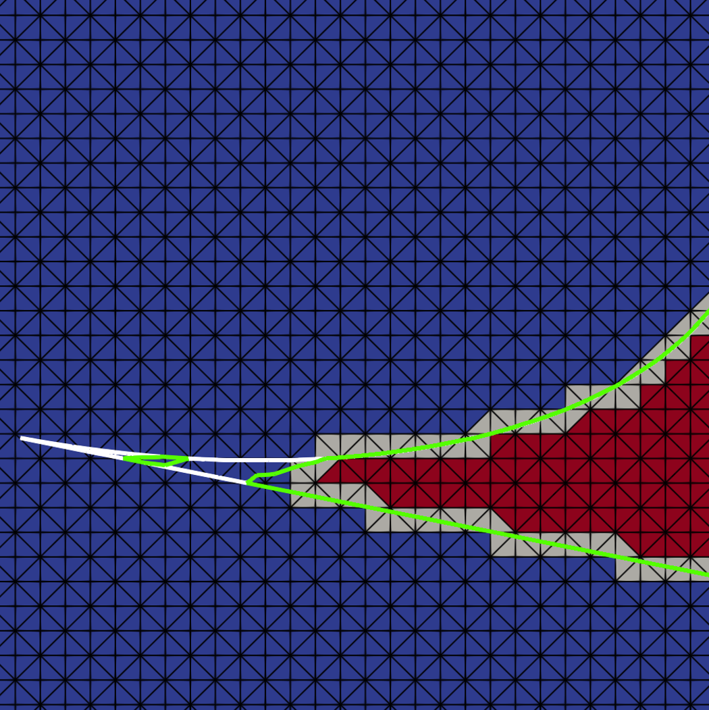
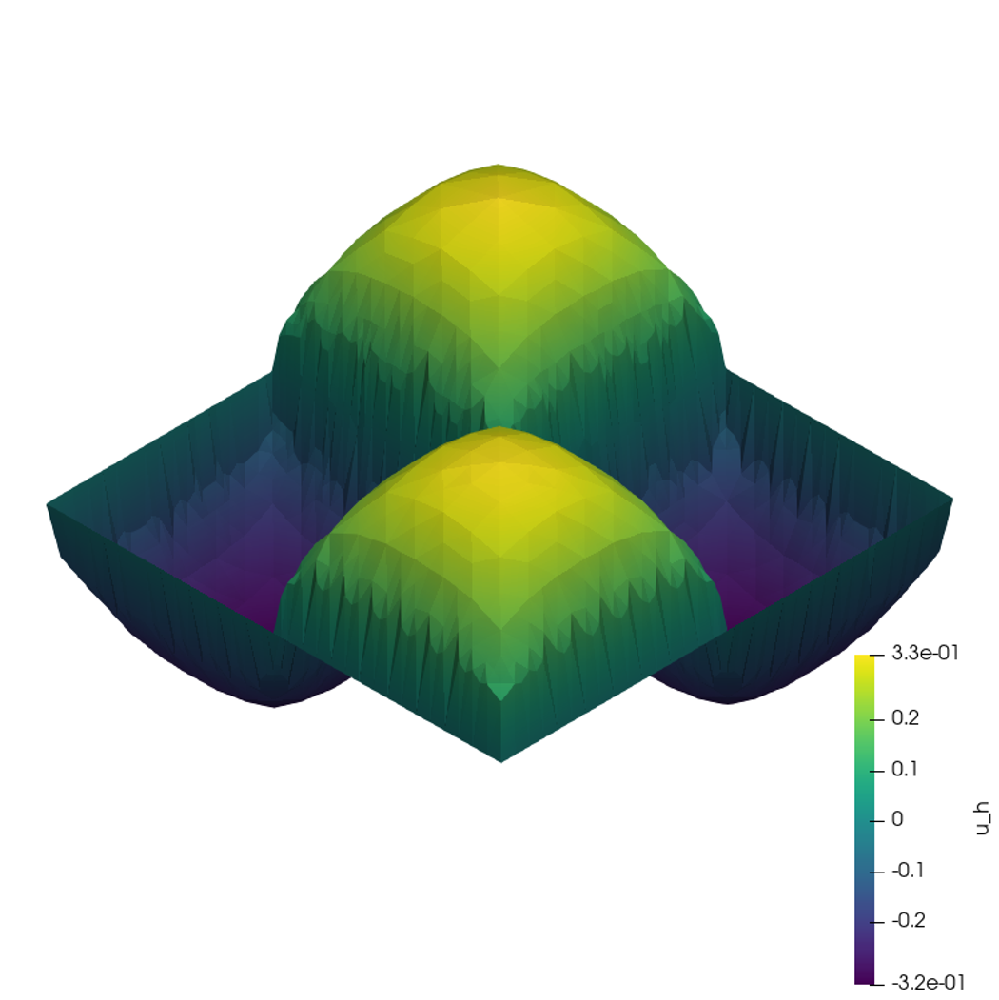
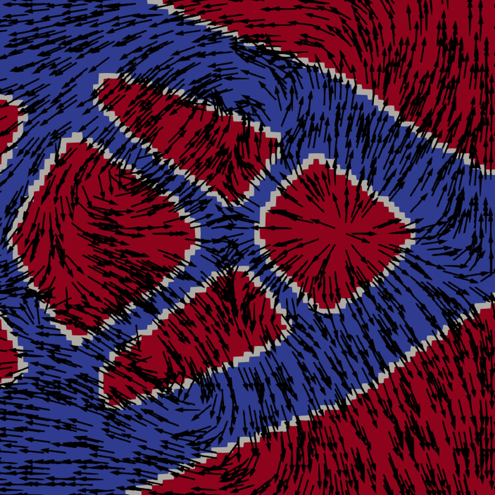
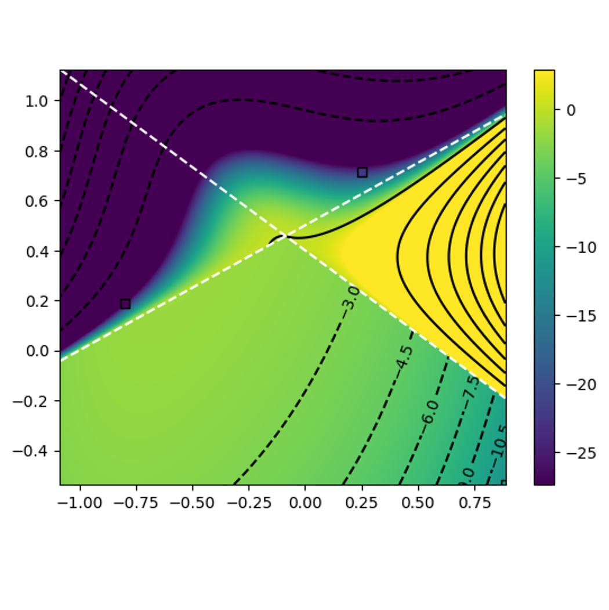
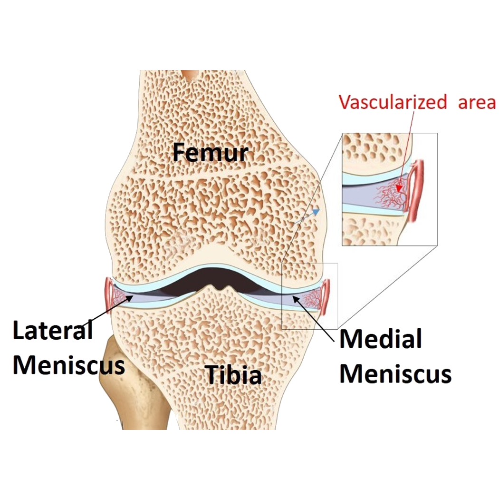

::: {layout="[2,1]"}

::: {style=""}

Since October 2024, I am a post-doc researcher in the team-project [MIMESIS]("https://mimesis.inria.fr") at [Centre Inria de l'Université de Lorraine](https://www.inria.fr/fr/centre-inria-universite-lorraine), in Strasbourg 🥨 France.  

My current work is about **a posteriori error estimation** and **adaptive mesh refinement** for the **immersed boundary method** called <a href="https://epubs.siam.org/doi/10.1137/19m1248947" target=_blank>$\varphi$-FEM</a>.
As a member of MIMESIS my work aims at providing numerical tools for **biomecanics and biomedical simulations**.  

:::

::: {style=""}

{width=300}

:::

:::

#### My research interests include:

::: {layout="[[-0.1,1,1,1,-0.1],[-0.1,1,1,1,-0.1]]"}

:::