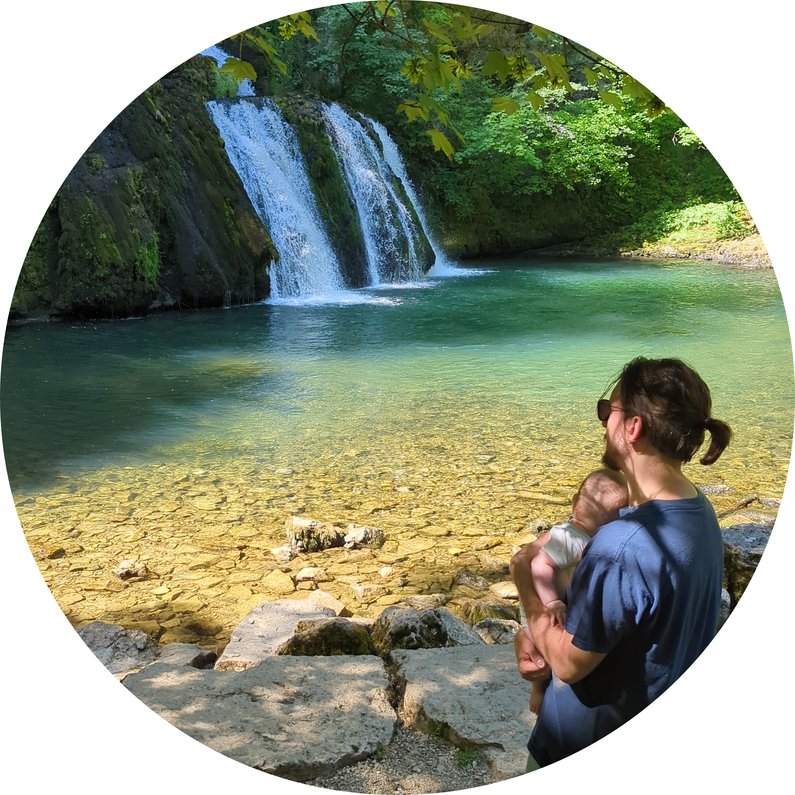
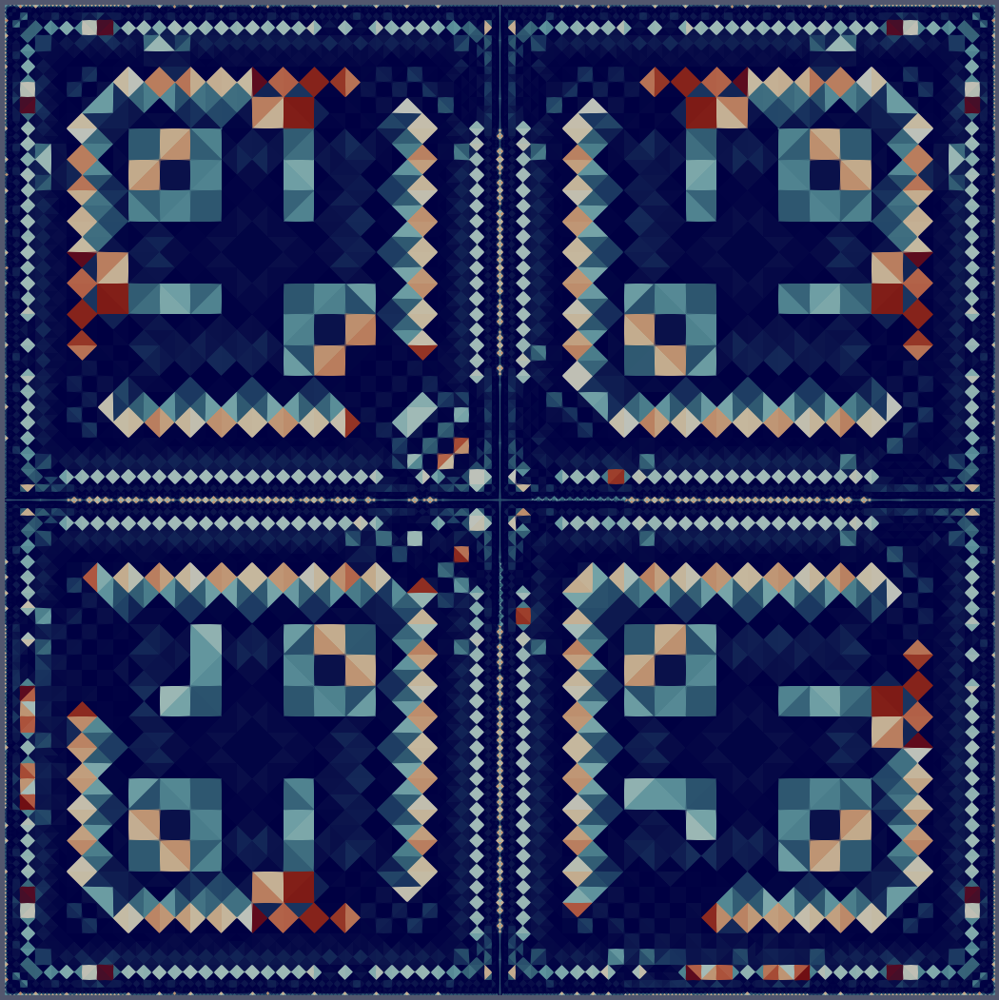
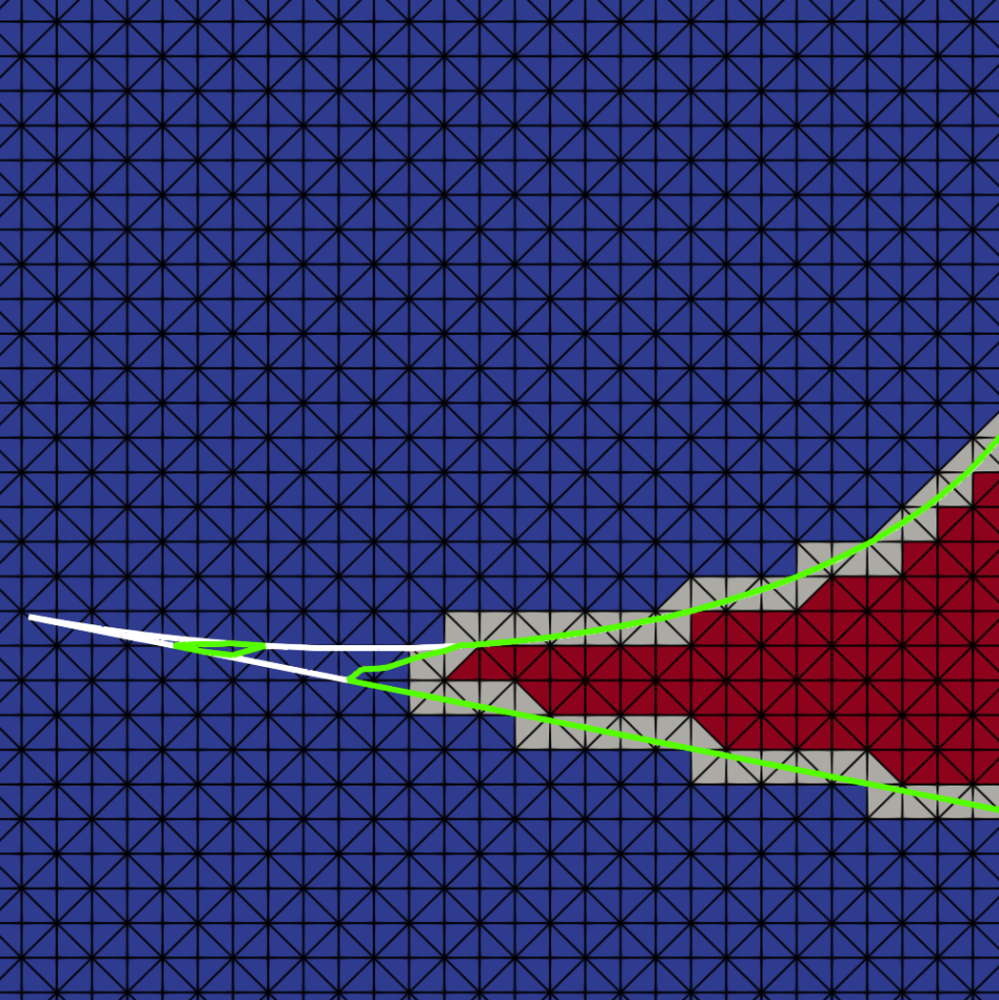
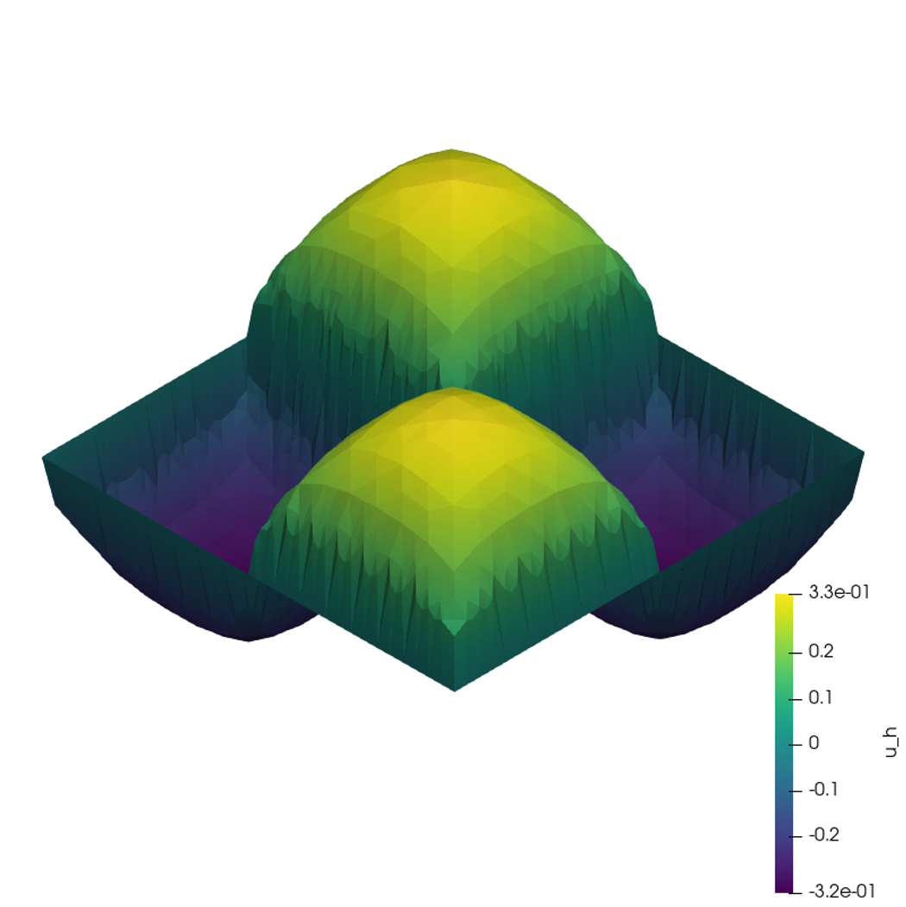
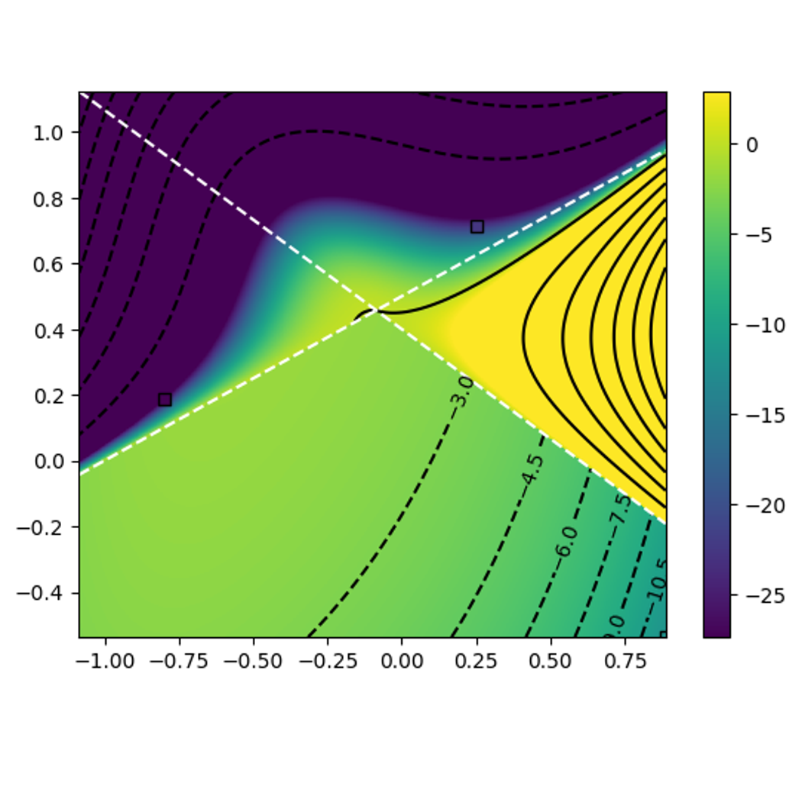
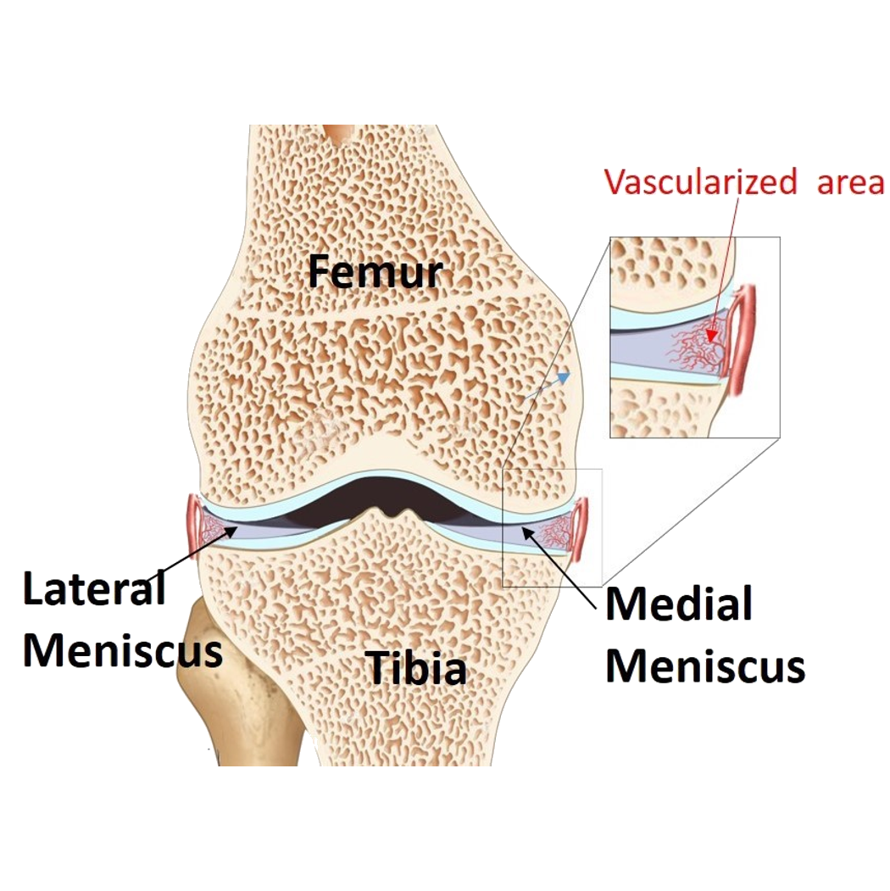
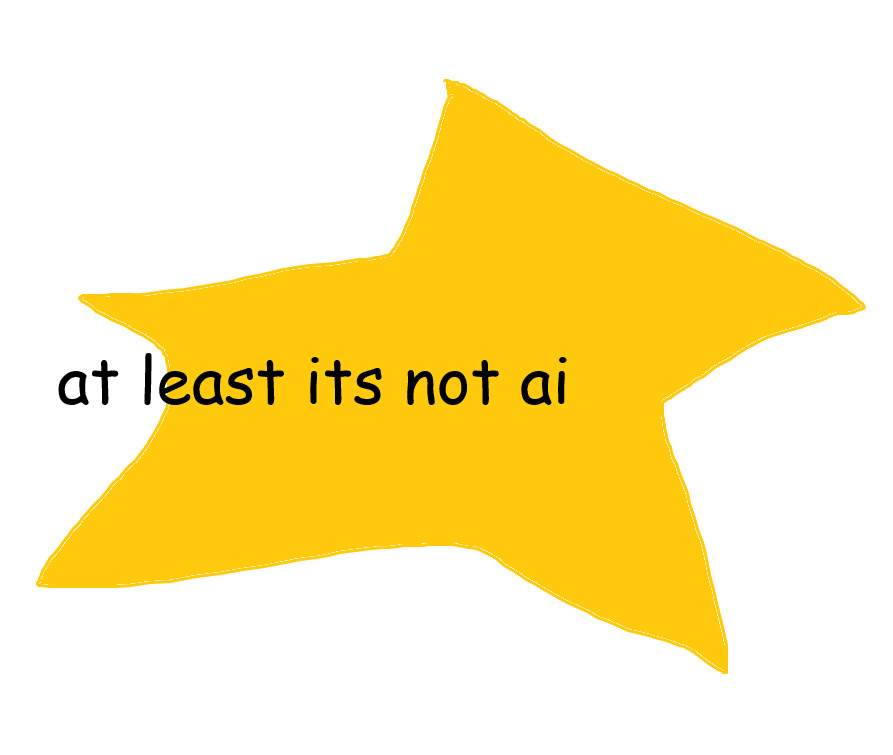

::: {layout="[1.5,1]" layout-valign="center"}

::: {style=""}

Since October 2024, I am a post-doc researcher in the team-project [MIMESIS](http://mimesis.inria.fr) at [Centre Inria de l'Université de Lorraine](https://www.inria.fr/fr/centre-inria-universite-lorraine), in Strasbourg 🥨 France.  

My current work is about **a posteriori error estimation** and **adaptive mesh refinement** for the **immersed boundary method** called <a href="https://epubs.siam.org/doi/10.1137/19m1248947" target=_blank>$\varphi$-FEM</a>.
As a member of MIMESIS my work aims at providing numerical tools for **biomecanics and biomedical simulations**.  

:::

::: {style=""}

{width=400}

:::

:::

#### My research interests include:

::: {layout="[[-0.1,1,1,1,-0.1],[-0.1,1,1,1,-0.1]]"}

:::

#### Generative AI disclaimer

::: {layout="[1,3]" layout-valign="center"}

{width=400}

::: {style=""}

I am strongly opposed to the use of frontier generative AI models (chatGPT, Claude, Gemini, Mistral and so on...), therefore all the work I produce by myself (such as this website) is generative AI-free.

If you are wondering why, you can find hereafter a melting-pot of writings explaining (mostly) my position on genAI (I plan to write my own post one day when I find some time). My position does not align exactly with everything that is written in this list but has a non-empty intersection with each one of these items.

- [https://airesistlist.org/](https://airesistlist.org/)
- [https://aeporreca.org/blog/why-we-should-reject-ai-in-academia/](https://aeporreca.org/blog/why-we-should-reject-ai-in-academia/)
- [https://gh.copernicus.org/articles/80/163/2025/](https://gh.copernicus.org/articles/80/163/2025/)
- [https://leidendeclaration.ai/](https://leidendeclaration.ai/)
- [https://www.slow-science.com/](https://www.slow-science.com/)
- [https://aiandeducation.mit.edu/report/](https://aiandeducation.mit.edu/report/)
- [https://www.theguardian.com/commentisfree/2026/aug/05/anthropic-ai-destroying-books](https://www.theguardian.com/commentisfree/2026/aug/05/anthropic-ai-destroying-books)
- [https://atecopol.hypotheses.org/13082](https://atecopol.hypotheses.org/13082)
- [https://greenit.eco/lia-un-geant-energetique-et-environnemental-synthese-de-letude-green-it-2025/](https://greenit.eco/lia-un-geant-energetique-et-environnemental-synthese-de-letude-green-it-2025/)
- [https://lapensionalmayer.wordpress.com/2026/09/30/creer-comme-un-riche/](https://lapensionalmayer.wordpress.com/2026/09/30/creer-comme-un-riche/)
- [https://www.arthurperret.fr/blog/2026-07-07-une-boussole-pour-naviguer-dans-la-tempete-ia.html](https://www.arthurperret.fr/blog/2026-07-07-une-boussole-pour-naviguer-dans-la-tempete-ia.html)

:::

:::